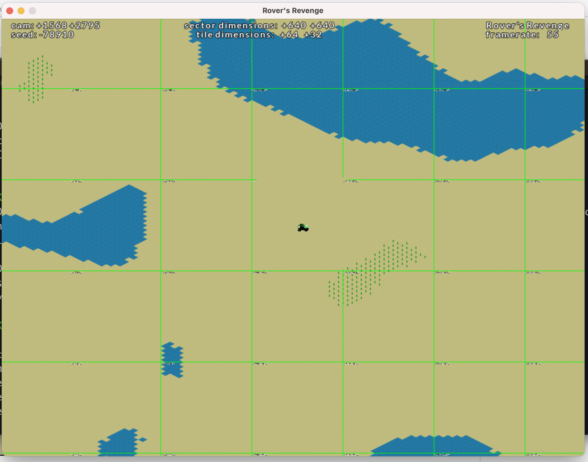

# SDL2 isometric demo

Simple isometric (2:1) SDL2 starter project.



# Build

## Prerequisites

```sh
brew install cmake
brew install sdl2
brew install sdl2_mixer
brew install sdl2_image
brew install catch2
```

## Build (cmake)

```sh
mkdir build && cd build
cmake ..
cmake --build .
./SDL2Test
```

(`cmake --build .` can be substituted with `make`)

## Assets

The boat sprite sheet is created with Blender 2.9 with [this](https://github.com/chrishayesmu/Blender-Spritesheet-Renderer) plugin for rendering 3D models as 2D sprite sheets.

The camera positioning has to be just right for the sprite sheet to project with correct isometric proportions. The Blender project files are included (along with my base template) with all the correct camera angles.

I had originally made a very basic wedge sprite sheet frame-by-frame in Affinity Designer, but realised very quickly that I no hope in hell of making anything more complex or doing animation that way. Making a change to one frame would require equivilent changes to the rest (different angle, meaning different changes). 

The second sprite sheet was made in MagicaVoxel, I was actually very happy with the results. It lets you model a sort of 3D shape using small cubes (I believe it's called a Voxel model) and it spits out a sprite sheet with no fuss. The let down came when I tried to do animation! I found that MagicaVoxel 0.98 had the ability to do frame-by-frame animation, but the functionality was removed from version 0.99; I absolutely could not get get MagicaVoxel 0.98 to run on my M1 MacBook running Big Sur, only 0.99 would run. I could only get 0.98 to run on my old MacBook, but it's way too old for me to even consider doing real work on it.

I think I was trying everything I could think of to avoid Blender. The learning curve just seemed so steep at the time, but I eventually accepted that it is the way to make isometric sprite sheets. I read about some famous isometric games, and it seems that the majorty really are just renders from 3D models made in the likes of Blender.
I'm glad I just accepted it started learning blender, it would surprise you how little time it takes to acquire enough knowledge to be dangerous ;)


## References

[CMAKE documentation](https://cmake.org/cmake/help/latest/guide/tutorial/index.html#build-and-test)

## Development tips

To avoid having to regenerate the build every time the assets change during development:

```sh
mkdir build && cd build
cmake ..
cmake --build .
rm -r assets
ln -s ../assets assets
./SDL2Test
```

Now the assets will always by in sync within the build. All you have to worry about is re-running `make` from the `build` folder.

## Useful commands (Macs only, mostly)

Convert an image to bitmap:

```sh
sips -s format bmp ${INPUT_FILE}.tiff --out ${OUTPUT_FILE}.bmp
```

Get file dimensions:

```sh
sips -g pixelHeight -g pixelWidth ${INPUT_IMAGE}
```

Merge animation frames into spritesheet with ImageMagick:

```sh
montage water_tile_0_0*.png -tile 10x10 -geometry 256x128+0+0 water_tile_0_sheet.png
```

## Thinking aloud

The Crystaline Conundrum - EDIT: HAHAHA, WHAT!?

## TODOS

- Better shutdown code
- Modify sprite->render to take x and y co-ordinate (instead of a rect)
- Implement sprite selector module