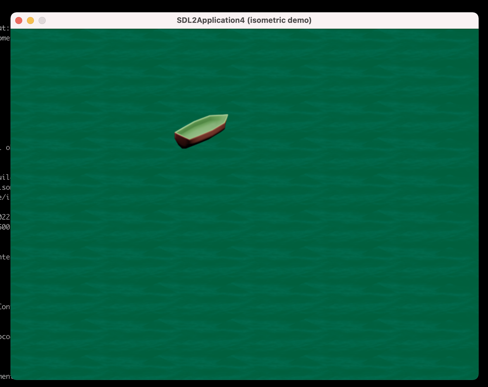

# SDL2 isometric demo

Simple isometric (2:1) SDL2 starter project.



# Build

## Prerequisites

```sh
brew install sdl2
brew install cmake
brew install sdl2_image
```

## Build (cmake)

```sh
mkdir build && cd build
cmake ..
cmake --build .
./SDL2Test
```

(`cmake --build .` can be substituted with `make`)

## References

[CMAKE documentation](https://cmake.org/cmake/help/latest/guide/tutorial/index.html#build-and-test)

## Useful commands (Macs only, mostly)

Convert an image to bitmap:

```sh
sips -s format bmp ${INPUT_FILE}.tiff --out ${OUTPUT_FILE}.bmp
```

Get file dimensions:

```sh
sips -g pixelHeight -g pixelWidth ${INPUT_IMAGE}
```
